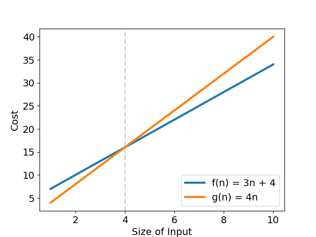

# 演算法要點

1. 演算法的定義:為完成某一特定工做，所設計出的一組有限、有序的指令集合
2. 演算法須符合:
   - 輸入(不一定需要)
   - 輸出(必須有)
   - 明確性(每個步驟需有明確的定義，不能含糊不清)
   - 有限性(在有限的步驟之後一定能終止)
   - 有效性(AL 的每一指令必須是基本且可以有效執行的指令)

# ADT(Abstract Data Type)

## 三要素

1. 一個特定的 Domain
2. 一個運算的集合
3. 一些描述運算的 axioms

# 漸進式表示法

## 五種 Asymptotic Notations

### Big-O notation

`描述演算法成長趨勢的 upper bound 「最壞情況的時間複雜度」`  
假設有一演算法實際複雜度為 f(n)=3n+4，有一組 k=4; g(n)=n; n=4 滿足  
`∀n>4, 0≤f(n)=3n+4≤4n`  
意思是「f(n)的上界成長趨勢最終不會超過 g(n)=4n」，此時 f(n) 被定義為 O(g(n))  
可得演算法最差複雜度為 f(n)=O(n)，`也就是「該演算法的成長趨勢不會比 g(n)來得快」`  
而在 n=4 之後 Big-O 的定義才恆成立

### Big-Ω notation

`描述演算法成長趨勢的 lower bound 「最優情況的時間複雜度」`  
f(n)=Ω(g(n)) : ∃k>0 ∃n0 ∀n>n0 |f(n)|≥k⋅g(n)

以 f(n)=3n+4
為例，有一組 k=2; g(n)=n; n0=0 滿足上式  
因此這個演算法在輸入資料夠大時，「至少」會達到 Ω(n)的複雜度  
`也就是「該演算法的成長趨勢不會比 g(n)來得慢」`

### θ notation

`Big O 與 Big Omega兩個asymptotic notation所夾出的範圍`

### little-o notation

`strict  upper bound`

### little-ω notation

`strict  lower bound`

## Asymptotic Notation 的基本特性

1. Transitive(Big-O、Big-Ω、θ、little-o、little-ω 的關係皆符合遞移性)
2. Reflexive(Big-O、Big-Ω、θ 的關係皆符合遞移性)
3. Symmetric(θ 的關係皆符合遞移性)
